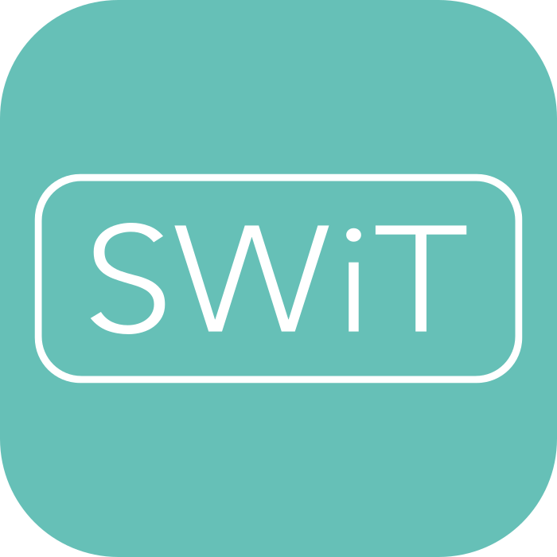
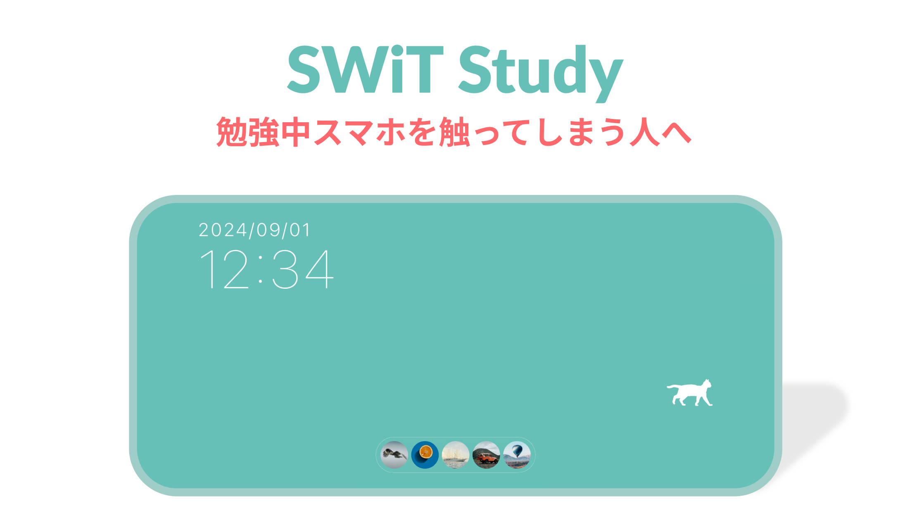

# SWiT Study

## 概要

**SWiT Study** は、勉強中にスマホを触ってしまう人向けのアプリです。  
このアプリでは、以下の機能を通じて効率的な学習をサポートします。

- **勉強時間の共有・監視**  
  アプリを開いている間、あなたの勉強時間がフレンドと共有され、他のアプリを開くとフレンドに通知が送られ、学習に集中できる仕組みです。

- **勉強ログの記録**  
  勉強している時間が自動的にログとして記録され、自分とフレンドの勉強時間を簡単に確認できます。

- **カスタマイズ可能なレイアウト**  
  勉強中に表示される画面を自由にカスタマイズ可能。お気に入りのラベルを設定してモチベーションアップに繋げましょう。

SWiT Study で、フレンドとともに効率の良い勉強を目指しましょう！

## インストール方法

- **iOS 版**：[App Store](https://apps.apple.com/jp/app/swit-study/id6497793213)
- **Android 版**：[Google Play](https://play.google.com/store/apps/details?id=com.swit91d08.swit)
